<!-- omit in toc -->
# ARM Architecture
<!-- omit in toc -->
## <a name="toc"></a> Table of Contents
- [ARM Overview](#arm-overview)
- [AMBA Overview](#amba-overview)  
   - [Why Do We Need On-Die Interconnect?](#why-on-die-interconnect)  
   - [AMBA AHB](#amba-ahb) 
     - [AMBA AHB Signal List](#amba-ahb-signals)
     - [AMBA AHB Master](#amba-ahb-master)
     - [AMBA AHB Slave](#amba-ahb-slave)
     - [AMBA AHB Basic Transfer](#amba-ahb-basic-transfer)
   - [AMBA APB](#amba-apb) 
     - [AMBA APB Interface](#amba-apb-interface)
     - [AMBA APB Signal List](#amba-apb-signals)
     - [AMBA APB](#amba-apb-state)
     - [AMBA APB Read](#amba-apb-read)
     - [AMBA APB Write](#amba-apb-write)
  - [AMBA AXI](#amba-axi) 
-  [Performance Metrics and Timing Concepts in Circuits](#perf_metrics)
   
<br/>

<!-- omit in toc -->
## <a name="arm-overview"></a> ARM Overview  [<sub><sup>Back to Table of Contents</sup></sub>](#toc)
---
<p align="center">
  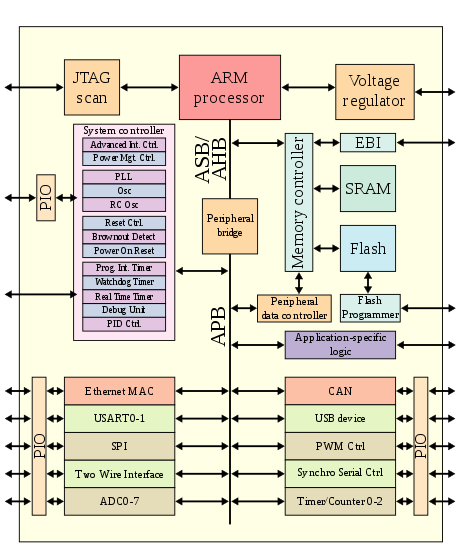
  <br>
    <a href="https://en.wikipedia.org/wiki/ARM_architecture_family">ARM Architecture Family Wikipedia</a>
</p>  
<br/>  

ARM architecture is a widely used and highly popular architecture for designing efficient and power-effective processors. It offers a range of processors suitable for various applications, from small embedded devices to high-performance computing systems. At a high level, ARM processors are based on a load-store architecture, where data processing occurs between registers and memory. They employ a pipeline structure that enables concurrent execution of multiple instructions, resulting in improved performance.

ARM architecture is characterized by its emphasis on low power consumption, scalability, and versatility. It provides a wide range of processor cores, such as ARM Cortex-A, Cortex-R, and Cortex-M, each optimized for specific application domains. The architecture supports various features, including instruction sets, memory management units, and co-processor interfaces, to cater to different requirements. ARM processors also leverage advanced techniques like branch prediction, caching, and out-of-order execution to enhance performance. Additionally, ARM's architectural licensing model allows for customization and integration of ARM processors into diverse system-on-chip (SoC) designs, enabling efficient and tailored solutions for specific applications.

Overall, the ARM architecture stands as a dominant force in the semiconductor industry, powering a vast array of devices and systems. Its blend of performance, power efficiency, scalability, and flexibility has made it a go-to choice for designers seeking high-performance computing solutions with low power consumption and adaptable architecture.


<br/><br/>


<!-- omit in toc -->
## <a name="amba-overview"></a> AMBA Overview [<sub><sup>Back to Table of Contents</sup></sub>](#toc)
---
The Advanced Microcontroller Bus Architecture (AMBA) is a fundamental component in System-on-Chip (SoC) designs. Created by ARM Ltd., AMBA serves as a communication bridge between various elements within an SoC, including processors, memory controllers, and peripheral devices. It offers a standardized approach for high-capacity data transfer, enhancing the efficiency, flexibility, and scalability of modern, high-performance devices. With its widespread adoption, AMBA has become the industry standard, streamlining the design process and propelling high-speed computing applications.

<p align="center">
  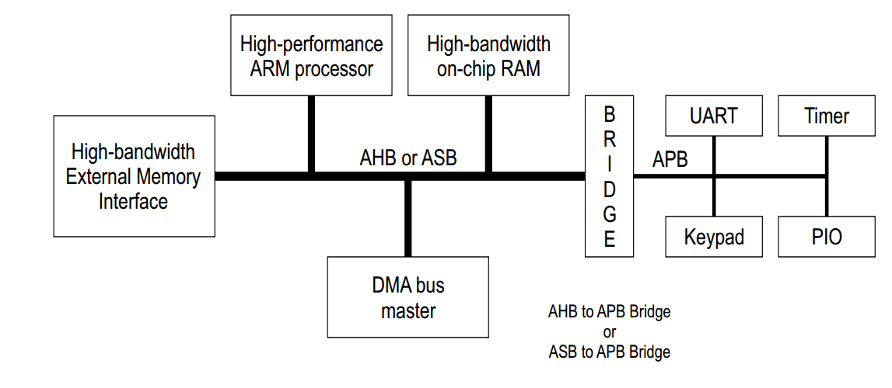
  <br>
    <a href="https://www.allaboutcircuits.com/technical-articles/introduction-to-the-advanced-microcontroller-bus-architecture/">AMBA Architecture</a>
</p>

<br/><br/>

<!-- omit in toc -->
### <a name="why-on-die-interconnect"></a> Why Do We Need On-Die Interconnect? [<sub><sup>Back to Table of Contents</sup></sub>](#toc)

<p align="center">
  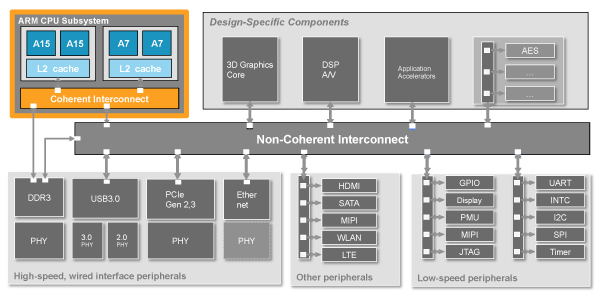
  <br>
    <a href="https://www.chipestimate.com/Multicore-ARM-SoCs-Face-Cache-Coherency-Dilemma/Cadence/Technical-Article/2012/10/02">ARM Interconnect Example</a>
</p>

The on-die interconnect is a central element in the structure and functioning of a microprocessor or a System-on-Chip (SoC). Consider it the high-speed transportation system within the dense cityscape of a chip. It interlinks all the critical parts of the city - the CPU, memory, cache, and peripherals, ensuring smooth and rapid transit of data across the entire metropolitan area (the chip).

Imagine the interconnect as the highway system within a city, connecting different parts of the city, like the CPU, memory, cache, and peripherals. If the highway is within the city (on-die), travel between different parts becomes quicker and more efficient - there's no need to travel long distances between different cities (off-chip), which takes more time and energy.

The reason for this enhanced efficiency is that data doesn't need to leave the chip to move between different components. This cuts down on delays, boosting overall performance. Plus, it reduces energy consumption, crucial for devices like smartphones where battery life is key.

Now, onto coherent and non-coherent interconnects. Think of a coherent interconnect as a shared document, where everyone can see and respond to the latest changes others have made. This type of 'seeing the latest changes' is essential when different cores of a processor need to work together, sharing data seamlessly.

Non-coherent interconnects, on the other hand, are like everyone working on their own document - they don't need to see or respond to others' changes. This works best for components that operate independently, without needing shared data access.

In essence, on-die interconnects are fundamental to making a microprocessor or SoC efficient and fast. They provide the vital infrastructure needed for data communication and sharing, enhancing the functionality of the entire system, whether data needs to be shared (coherent) or not (non-coherent).
<br/><br/>


### <a name="bus-overview"></a> BUS Overview [<sub><sup>Back to Table of Contents</sup></sub>](#toc)
--- 
<p align="center">
  
  <br>
    <a href="http://contents.kocw.net/KOCW/document/2014/sungkyunkwan/hantaehee/4.pdf">Bus Master and Slave</a>
</p>
  
What is a bus? In computer architecture, a bus is a communication system that transfers data between different components inside a computer, or between different computers. The term comes from the Latin word "omnibus", which means "for all", and it accurately captures the function of a bus: a shared communication link used by many different devices.  
<br/>
A bus transactions consists of two parts:  

- Issuing the command (and address): request  
- Transfering the data: action  
  
<br/>
In the context of AMBA (Advanced Microcontroller Bus Architecture) or generally in digital electronics, the terms "master" and "slave" are used to define the roles of bus participants.

1. Master: A master is a device that initiates transactions on the bus. It generates the clock and control signals to dictate the data flow. In AMBA, a master could be a processor or a Direct Memory Access (DMA) controller that initiates read or write operations. In other words, master is the one that issues the commands (and address).

2. Slave: A slave is a device that responds to the transactions initiated by the master. It receives the control signals and responds to the data flow accordingly. In AMBA, slaves are typically peripheral devices such as memory modules, input/output interfaces, or other functional units. They wait for the master's commands to perform read or write operations. This means that slave is the one who responds to the address by sending the data to the master if the master ask for data or receiving data from the master if the master wants to send the data.

The master-slave communication model allows for precise control of data transfer, ensuring that only one device (the master) has the authority to control the data flow at any given time. This model is central to the operation of AMBA and other bus protocols. It's worth noting that the terminology is changing in the industry, with "initiator" and "target" or "requester" and "responder" being used instead of "master" and "slave", respectively.


#### Example of the bus transactions
**Sending data from the CPU to the USB device:**

1. The CPU (master) writes data to a specific location in its memory space that corresponds to a register or buffer in the USB controller (slave). This write operation is a command issued over the AMBA bus.
2. The AMBA bus protocol ensures this command is carried out effectively by managing the necessary handshaking, addressing, and data transfer.
3. Once the data is written to the USB controller's register or buffer, the USB controller takes over. It transmits this data to the connected USB device over the USB interface.

**Receiving data from the USB device to the CPU:**

1. When a USB device sends data (for example, a keyboard sending a keystroke), the USB controller first receives this data over the USB interface.
2. The USB controller writes this data to a specific buffer or register and then triggers an interrupt signal to the CPU.
3. In response to the interrupt signal, the CPU issues a read command over the AMBA bus to fetch the data from the USB controller's buffer.
4. Once again, the AMBA bus protocol handles the addressing, data transfer, and error detection during this operation.

This way, AMBA bus enables efficient communication between the CPU and the USB controller, which is crucial for an ARM SoC's functioning.

<br/><br/>  

<!-- omit in toc -->
## <a name="amba-ahb"></a> AMBA AHB [<sub><sup>Back to Table of Contents</sup></sub>](#toc)  
---  
<p align="center">
  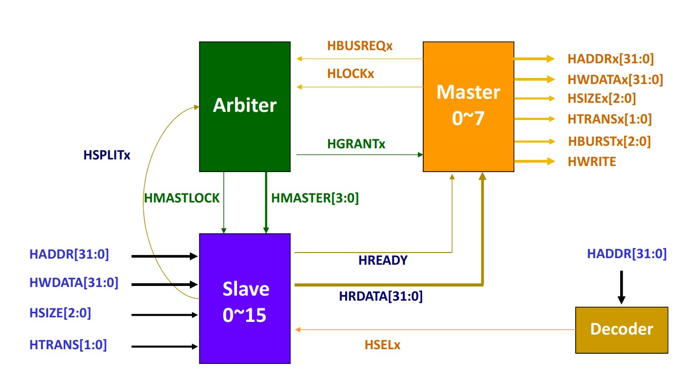
  <br>
    <a href="http://contents.kocw.net/KOCW/document/2014/sungkyunkwan/hantaehee/4.pdf">AMBA AHB Architecture</a>
</p>
<br/>  
<p align="center">
  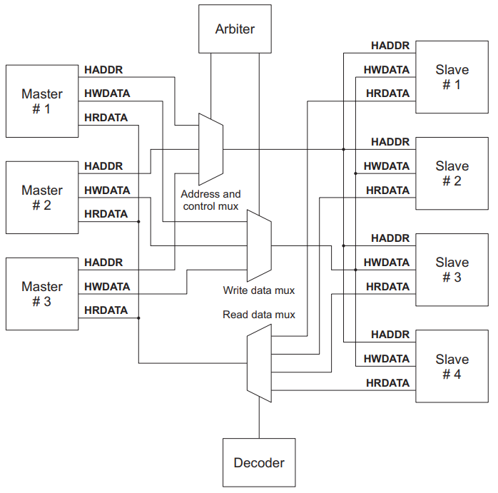
  <br>
    <a href="https://dxsm.github.io/p/ahb-protocal.html">AMBA AHB Architecture</a>
</p>
<br/>  


The Advanced High-performance Bus (AHB) is a part of ARM's Advanced Microcontroller Bus Architecture (AMBA). AHB is designed for high-performance system modules and is used in high-speed systems.

AHB's primary role is to connect high bandwidth components such as CPUs, DSPs, and memory elements to the system bus. By doing so, AHB acts as a high-performance system backbone bus, supporting efficient communication between these components.

The bus architecture of AHB is designed for low-power peripheral macro cell functions, connecting processors, on-chip memories, and off-chip external memory interfaces. It uses a non-multiplexed protocol, meaning it has separate buses for address and data, which improves the speed of data transfer.

In an AHB system, devices are designated as masters or slaves, similar to other bus architectures. Masters initiate data transfers, while slaves respond to them. AHB can support multiple masters and includes an arbitration scheme to determine which master gains control of the bus.

Furthermore, AHB employs pipelining and supports burst transfers, enabling it to start a new transfer before the previous one concludes and transfer a block of data at once, respectively. Both of these features significantly enhance data transfer efficiency.

**Arbiter**
- **Bus Control:** Controls which master has access to the bus when multiple masters request access simultaneously.
- **Arbitration Scheme:** Determines the next master to get the bus grant based on the implemented arbitration scheme (fixed priority, round-robin, etc.).
- **Handshake:** Completes the handshake with the requesting master by asserting the HGRANT signal.

**Master**
- **Address Generation:** Generates the addresses for read or write operations.
- **Transfer Type Selection:** Specifies the type of transfer (read or write).
- **Data Transfer:** Provides data for write operations and retrieves data for read operations.
- **Burst Information:** Sets the length of bursts for burst transfers.
- **Bus Request:** Requests access to the bus by asserting the HBUSREQ signal.
- **Lock Transactions:** Asserts the HLOCK signal when it needs to lock the bus for multiple transactions.
- **Error Handling:** Handles error conditions signaled by the slave through the HRESP signal.

**Slave**
- **Data Provision:** Provides data to the master during a read operation.
- **Data Reception:** Receives data from the master during a write operation.
- **Response Generation:** Generates a response (OKAY, ERROR) for each transfer.
- **Decode Address:** Decodes the address to check if the transaction is targeted to it.
- **Supports Burst Transfers:** It needs to support single and incrementing burst types.

**Decoder**
- **Address Decode:** Decodes the address lines to select the corresponding slave.
- **Slave Selection:** Asserts the select line of the corresponding slave when a valid address is placed by the master.
- **Support for Split Transactions:** If the architecture supports split transactions, the decoder is also responsible for handling the retry and split responses.

<br/><br/>

<!-- omit in toc -->
## <a name="amba-ahb-signals"></a> AMBA AHB Signal List [<sub><sup>Back to Table of Contents</sup></sub>](#toc)    


| Signal Name | Source | Destination | Description |
|-------------|--------|-------------|-------------|
| HCLK | Clock Source | All Modules | System clock for the bus |
| HRESETn | Reset Controller | All Modules | Bus reset signal |
| HADDR[31:0] | Master | Decoder/MUX to Slave/Arbiter | 32-bit system address bus |
| HTRANS[1:0] | Master | MUX to Slave | Current transfer type (IDLE=00, BUSY=01, NONSEQ=10, SEQ=11) |
| HWRITE | Master | MUX to Slave | Read/Write indicator (0 for read, 1 for write) |
| HSIZE[2:0] | Master | MUX to Slave | Size of current transfer (000 for 8-bit, 001 for 16-bit, 010 for 32-bit, etc.) |
| HBURST[2:0] | Master | MUX to Slave/Arbiter | Burst type (single, incr, wrap) |
| HPROT[3:0] | Master | MUX to Slave | Protection mechanism (for slaves with protection features) |
| HWDATA[31:0] | Master | MUX to Slave | Write data bus |
| HBUSREQx | Master | Arbiter | Bus access request |
| HLOCKx | Master | Arbiter | Master requires locked access to the bus (no other master should be granted the bus until this signal is low) |
| HRDATA[31:0] | Slave | MUX to Master/Arbiter | Read data bus |
| HREADY | Slave | MUX to Master/Arbiter | Signal that indicates the completion of a transfer. Low level extends the transfer cycle |
| HRESP[1:0] | Slave | MUX to Master/Arbiter | Transfer status (OKAY, ERROR, RETRY, SPLIT) |
| HSPLITx[15:0] | Slave | Arbiter | Tells the arbiter which master is allowed to retry a split transfer |
| HSELx | Decoder | Slave | Slave select signal |
| HGRANTx | Arbiter | Master | This signal indicates that bus master x is currently the highest priority master. A master gets access to the bus when both HREADY and HGRANTx are HIGH |
| HMASTER[3:0] | Arbiter | Slave with split capability | Indicates which master is performing the transfer, provides information for split operation |
| HMASTLOCK | Arbiter | Slave with split capability | Indicates that the current master is performing a locked transfer |

<br/><br/>
### <a name="amba-ahb-master"></a> AMBA AHB Master [<sub><sup>Back to Table of Contents</sup></sub>](#toc)    
 
<p align="center">
  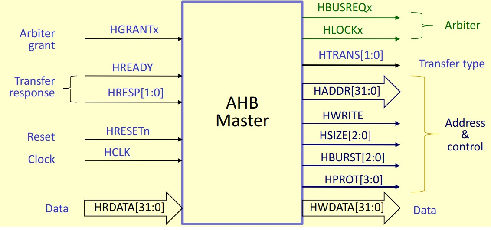
  <br>
    <a href="http://contents.kocw.net/KOCW/document/2014/sungkyunkwan/hantaehee/4.pdf">AMBA AHB Master</a>
</p>
<br/>
  
The AMBA AHB Master serves as the initiator of transactions on the AMBA AHB bus. It generates the control signals, issues commands, and handles the transfer of data over the bus. Key responsibilities of the AHB master include:

- **Initiating read or write operations:** The AHB master sets up the command, address, and control signals required for a transaction. 

- **Managing data transfers:** Depending on the operation, the master either sends data (write operation) to a slave or receives data (read operation) from a slave.

- **Handshake protocol:** The master handles the necessary handshaking signals (such as HREADY and HRESP) to ensure successful completion of transactions.

Examples of AHB master components in an SoC can include a CPU, a DMA (Direct Memory Access) controller, or any other peripheral that needs to initiate data transfers on the bus. Each of these components can act as an AHB master when they need to read or write data over the bus. The exact implementation of the master can vary based on the specific requirements of these components.

 <br/>
<p align="center">
  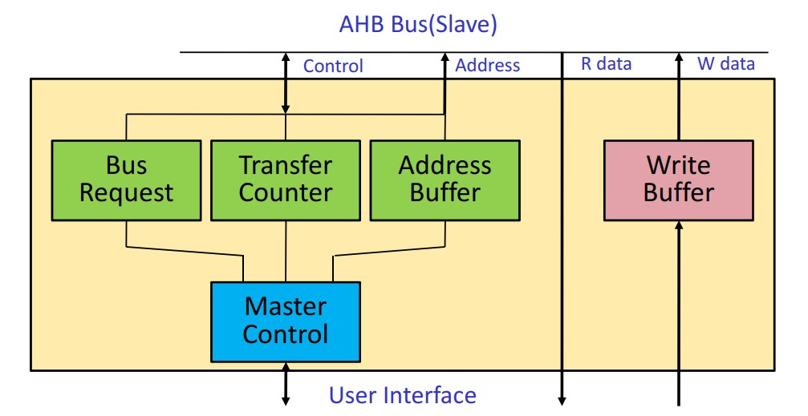
  <br>
    <a href="http://contents.kocw.net/KOCW/document/2014/sungkyunkwan/hantaehee/4.pdf">AMBA AHB Master Interface</a>
</p>
<br/>  

**Master Control**
- Manages the overall operation of the AHB master interface.
- Responsible for initiating bus requests and releasing them when no more transfers are required.

**Bus Request**
- When the master requires the bus, it asserts a bus request signal to the arbiter.
- The master must continue to assert the bus request until it receives a bus grant signal from the arbiter.

**Transfer Control**
- Manages all aspects of data transfer, such as setting up, executing, and completing data transfers.
- Takes care of differentiating between single transfers, incremental bursts, or wrap-around bursts.

**Address Buffer**
- A queue that temporarily holds the addresses to be used for read/write operations.
- Allows the master to continue to perform operations while waiting for the arbiter to grant the bus.

**Write Buffer**
- A queue that temporarily holds the data to be written to a slave.
- Provides time for the master to set up for data write operations while waiting for the bus grant.
  
<br/><br/>

### <a name="amba-ahb-slave"></a> AMBA AHB Slave [<sub><sup>Back to Table of Contents</sup></sub>](#toc)    
<p align="center">
  
  <br>
    <a href="http://contents.kocw.net/KOCW/document/2014/sungkyunkwan/hantaehee/4.pdf">AMBA AHB Slave</a>
</p>
<br/>  

The AMBA AHB Slave responds to transactions initiated by the AHB master on the AMBA AHB bus. The slave receives the control signals, responds to the commands, and manages the transfer of data over the bus. Key responsibilities of the AHB slave include:

- **Responding to read or write operations:** The slave receives the command, address, and control signals from the master. Depending on the operation, it either sends data (read operation) to the master or receives data (write operation) from the master.

- **Managing data transfers:** The slave is responsible for holding the data being read by the master or storing the data being written by the master.

- **Handshake protocol:** The slave responds to the handshaking signals from the master (such as HREADY and HRESP) to ensure successful completion of transactions.

Examples of AHB slave components in an SoC can include memory modules like RAM or ROM, input/output interfaces, or any other peripheral that needs to respond to data transfers on the bus. Each of these components can act as an AHB slave when the master reads from or writes to them. The exact implementation of the slave can vary based on the specific requirements of these components.

 
<br/><br/>


<!-- omit in toc -->
### <a name="amba-ahb-basic-transfer"></a> AMBA AHB Basic Transfer [<sub><sup>Back to Table of Contents</sup></sub>](#toc)   
<p align="center">
  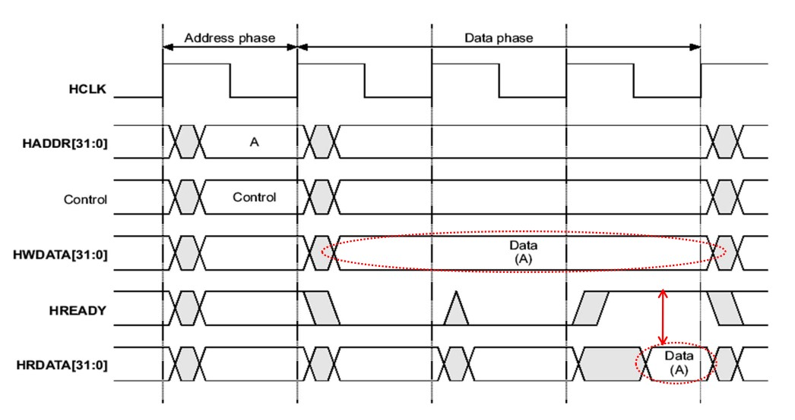
  <br>
    <a href="http://contents.kocw.net/KOCW/document/2014/sungkyunkwan/hantaehee/4.pdf">AMBA AHB Basic Transfer</a>
</p>
<br/>  
In AMBA AHB (Advanced Microcontroller Bus Architecture Advanced High-performance Bus), the communication or data transfer process can be divided into two main phases: the address phase and the data phase.
  
<br/>  

1. **Address Phase**
   - This is the initial phase of any data transfer where the master places the address and control signals on the bus.
   - Address signal `HADDR`, control signal `HTRANS`, and write data signal `HWDATA` (for write operations) are asserted.
   - Only one address phase occurs at a time, always followed by a data phase.

2. **Data Phase**
   - This phase occurs after the address phase and is where the actual data transfer happens.
   - During a read operation, the slave places the requested data on `HRDATA`.
   - During a write operation, the master places the write data on `HWDATA`.
   - A single address phase can be followed by multiple data phases during a burst transfer.

These two phases together make a complete transaction on the bus. AMBA AHB supports various data transfer types such as single transfers (one address phase, one data phase) and burst transfers (one address phase, multiple data phases).  
<br/>
In the figure above:

- The `HWDATA` line represents the data being sent from the master to the slave. The specific data is placed on the `HWDATA` bus when the transfer begins.

- Concurrently, the `HWRITE` line (a part of the control signals) indicates the type of operation. If `HWRITE` is HIGH, it's a write operation from the master to the slave. If `HWRITE` is LOW, it's a read operation from the slave to the master.

- During a **write operation**, the slave consumes the data from the `HWDATA` bus once the `HREADY` signal is asserted by the slave. The `HREADY` signal being set to '1' indicates that the slave has completed processing the current transfer and is ready for the next one. If the slave were a slower component and needed more time to process the transfer, it would set `HREADY` to '0', effectively stalling the bus until it was ready to handle the next transfer.

- During a **read operation**, the slave puts the requested data onto the `HRDATA` line following the assertion of `HREADY`. This represents data being sent from the slave back to the master.

This sequence of events illustrates the flow of data transfers on the AHB bus, where the type of operation (read or write) is dictated by the `HWRITE` signal and the pace of transfer is controlled by the `HREADY` signal.


<br/><br/>
<!-- omit in toc -->
### <a name="a"></a> AMBA AHB Basic Read Transaction [<sub><sup>Back to Table of Contents</sup></sub>](#toc)   
<p align="center">
  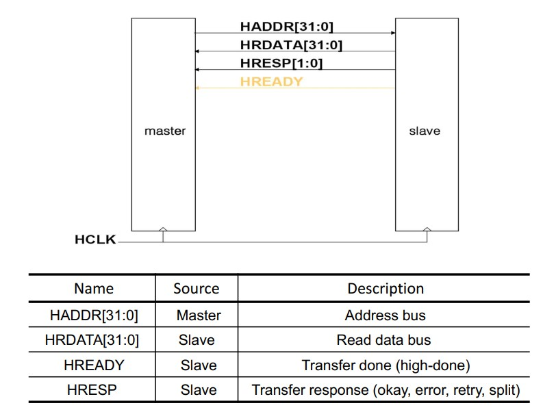
  <br>
    <a href="http://contents.kocw.net/KOCW/document/2014/sungkyunkwan/hantaehee/4.pdf">AMBA Basic Read Signals</a>
</p>
<br/>  

During a basic AHB read:

- `HADDR`: This is the address bus, which is driven by the master (the entity initiating the transaction). In a read operation, the master will put the desired address onto the `HADDR` line to tell the slave (the entity responding to the transaction) from where to read data.
  
- `HRDATA`: Once the slave has processed the read request (which could potentially take multiple clock cycles if it is a slow peripheral), it places the requested data onto the `HRDATA` bus and asserts the `HREADY` signal. The master, once seeing that `HREADY` is '1', will then latch the data from `HRDATA`.

- `HREADY`: This is the signal that the slave uses to indicate that it is ready for a data transfer. In the beginning, the master does not need to check the status of `HREADY`. The master simply places the address on `HADDR` and asserts the control signals for a read operation. However, after this, the master must wait until `HREADY` is '1' (indicating that the slave is ready) before it can consider the read transaction complete.

- `HRESP`: This is the response from the slave, typically indicating the status of the transaction. The possible responses are:

    - `OKAY` signifies a successful transaction. Most slaves will always return `OKAY` unless there is some sort of bus error.

    - `ERROR` indicates that the transaction was unsuccessful due to a bus error or some other issue at the slave's end.

    - `SPLIT`. This informs the master that the transaction will be "split" and completed later when the slave is free. The master should then terminate the current transaction and attempt it again later. In a typical read operation, the master will check HRESP after HREADY has been asserted to ensure that the read was successful.

    - `RETRY` signals the master to attempt the same transaction again later. This typically happens when the slave is temporarily unable to handle the transaction but might be able to do so later.

In a typical read operation, the master will check `HRESP` after `HREADY` has been asserted to ensure that the read was successful and take appropriate actions based on the response.


To summarize, a basic read operation involves the master putting the address onto `HADDR` and then waiting until `HREADY` is asserted by the slave. Once `HREADY` is '1', the master reads the data from `HRDATA` and checks `HRESP` to make sure there were no errors. 

<br/>   

**Example of a Basic Read Operation:**

Consider a master wants to read data from the memory address '0x1000'.

1. **Cycle 1**: The master sets `HADDR` to '0x1000' and `HWRITE` to LOW (read operation).
2. **Cycle 2**: The master waits for `HREADY` to be HIGH (asserted by the slave).
3. **Cycle 3**: Once `HREADY` is HIGH, the master latches the data from `HRDATA`.
4. **Cycle 4**: The master checks `HRESP`:
    - `OKAY`: Transaction successful, master has the data.
    - `ERROR`: Error occurred, master will retry or handle the error.
    - `SPLIT`: Slave is busy, master will retry the transaction later.
    - `RETRY`: Slave suggests to retry the transaction later.


<br/> 
<p align="center">
  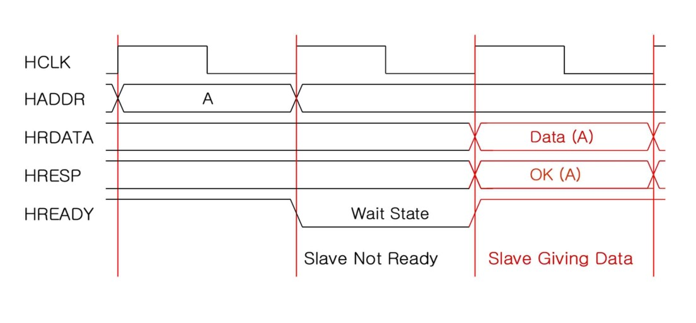
  <br>
    <a href="http://contents.kocw.net/KOCW/document/2014/sungkyunkwan/hantaehee/4.pdf">AMBA Basic Read Waveform</a>
</p>
<br/> 

The figure above shows that the AHB protocol allows slaves to introduce wait states if they need additional time to complete a transfer. The master must check the `HREADY` signal before proceeding to ensure the slave is ready for the transfer. The `HRESP` signal is also checked to verify the success of the transfer.  

- **Cycle 1**: At the start of the operation, the master presents the address and other control information on the bus. The `HREADY` signal is still high from the previous operation.

- **Cycle 2**: As the next cycle starts, the slave takes control of the `HREADY` signal. The slave deasserts the `HREADY` signal (sets it to low), indicating that it cannot complete the transfer in a single cycle and requires additional time. This period is referred to as a wait state.

- **Cycle 3**: In this cycle, the slave is finally ready. It places the requested data on the `HRDATA` bus, asserts `HREADY` back to high, and indicates a successful transfer with the `HRESP` signal set to 'OKAY'.

- **Cycle 4**: In the final cycle, the master latches the data from the `HRDATA` bus and can initiate a new transfer.

<br/><br/>  
<!-- omit in toc -->
### <a name="a"></a> AMBA AHB Basic Write Transaction [<sub><sup>Back to Table of Contents</sup></sub>](#toc)   
<p align="center">
  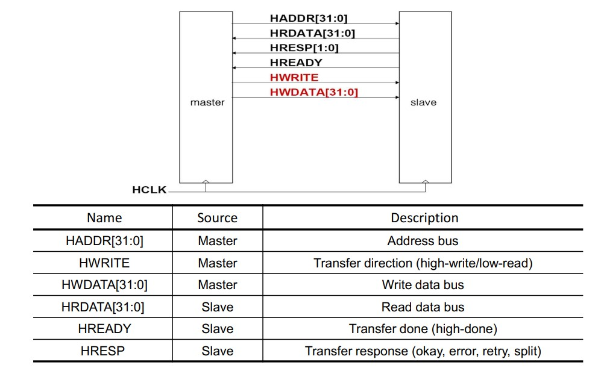
  <br>
    <a href="http://contents.kocw.net/KOCW/document/2014/sungkyunkwan/hantaehee/4.pdf">AMBA Basic Write Signals</a>
</p>
<br/>   

- **HADDR**: During a write operation, the master device identifies the target address for the write and places this address onto the `HADDR` bus.
  
- **HWRITE**: This control signal is set by the master to specify the operation type. For a write operation, `HWRITE` is set to HIGH, indicating to the slave device that a write operation is in progress.
  
- **HWDATA**: The data to be written by the master device is placed onto the `HWDATA` bus. This bus carries the data from the master to the slave during a write operation.

- **HRDATA**: This bus is used for read operations, allowing the slave to transfer data back to the master. During a write operation, `HRDATA` is not typically used and can be ignored.

- **HREADY**: This signal is driven by the slave device and is used to control the pace of data transfer. When the slave is ready to accept data, it asserts `HREADY` to HIGH. If the slave requires more time to prepare, it can deassert `HREADY` to LOW, which effectively stalls the operation until the slave is ready.

- **HRESP**: The slave uses `HRESP` to communicate the result of the operation to the master once the data transfer is complete. The slave could respond with `OKAY` (indicating that the operation was successful) or `ERROR` (indicating a problem occurred during the operation).
  

<br/>

**Example of a Basic Write Operation:**

Consider a master wants to write the data '1234' to the memory address '0x2000'.

1. **Cycle 1**: The master sets `HADDR` to '0x2000', `HWRITE` to HIGH (indicating a write operation), and `HWDATA` to '1234'.
2. **Cycle 2**: The master waits for `HREADY` to be asserted HIGH by the slave, indicating readiness for data reception.
3. **Cycle 3**: Once `HREADY` is HIGH, the master checks `HRESP` to see if the operation was successful:
    - `OKAY`: Transaction was successful, data has been written to the slave.
    - `ERROR`: An error occurred, the master will handle the error or retry the transaction.
    - `SPLIT`: Slave is busy, master will redo the transaction later.
    - `RETRY`: Slave suggests to retry the transaction later.


<br/> 
<p align="center">
  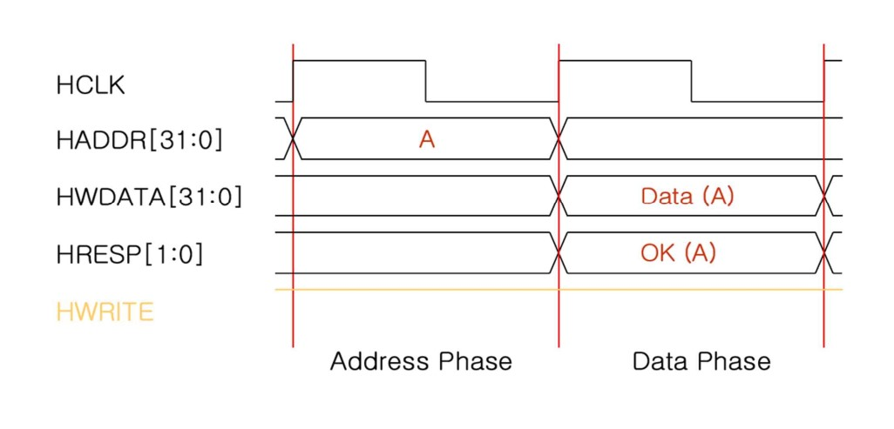
  <br>
    <a href="http://contents.kocw.net/KOCW/document/2014/sungkyunkwan/hantaehee/4.pdf">AMBA Basic Write Waveform</a>
</p>
<br/> 

In the above graph:

- **Cycle 1**: During the first cycle, the master starts a write operation by placing the desired address (A) onto the `HADDR` bus. At this point, the `HWRITE` signal is also set to HIGH, indicating that this is a write operation.

- **Cycle 2**: In the second cycle, the master places the actual data (Data(A)) to be written to the address (A) on the `HWDATA` bus. The slave, now ready to accept this data, asserts `HREADY` to HIGH. At the same time, the slave sends an `HRESP` signal of `OKAY`, signifying that the transfer was successful.

The `HWRITE` signal remains HIGH across all cycles, maintaining the operation as a write operation throughout.

<br/><br/>

<!-- omit in toc -->
### <a name="amba-apb"></a> AMBA APB [<sub><sup>Back to Table of Contents</sup></sub>](#toc)   
The Advanced Peripheral Bus (APB), part of the Advanced Microcontroller Bus Architecture (AMBA) family of protocols, plays a pivotal role in modern microcontroller systems. With its latest iteration being APB v2.0, bundled as part of the AMBA 4 release, APB has evolved to be an optimized interface solution with features such as minimal power consumption and simplified interface complexity.  
  
<br/>

Unlike its cousin, the Advanced High-performance Bus (AHB), APB is a non-pipelined protocol. It primarily serves to connect low-bandwidth peripherals, providing an effective means for interfacing with external peripherals within a System-on-a-Chip (SoC). An APB transfer is characterized by at least two clock cycles, namely the SETUP cycle and the ACCESS cycle. Moreover, APB can seamlessly interface with both AHB and Advanced eXtensible Interface (AXI) protocols through intermediary bridges.  

<br/>
<p align="center">
  
  <br>
    <a href="https://www.allaboutcircuits.com/technical-articles/introduction-to-the-advanced-microcontroller-bus-architecture/">AMBA Architecture</a>
</p>

<br/>

The above diagram illustrates the architecture of a typical system employing APB. At the core of the system is the high-performance ARM processor. The system also includes high-bandwidth components such as on-chip RAM, DMA bus master, and high-bandwidth memory interface. These components are connected to the ARM core via the system bus, in this case, the AHB.

Simultaneously, low-bandwidth peripherals like UART, Timer, Keypad, and Programmable Input Output (PIO) are linked to the system bus through the AHB to APB Bridge. This bridge serves a dual purpose: it acts as an AHB Slave for the ARM core (which is the AHB Master) and doubles as the APB Master for the low-bandwidth external peripherals.

In a typical setup, the AHB to APB Bridge is the sole component acting as the APB master, indicating that the generation of APB transfers is centralized at this bridge, ensuring streamlined control of peripheral communication within the system.

<br/><br/>
<!-- omit in toc -->
## <a name="amba-apb-interface"></a> AMBA APB Interface [<sub><sup>Back to Table of Contents</sup></sub>](#toc)    
<p align="center">
  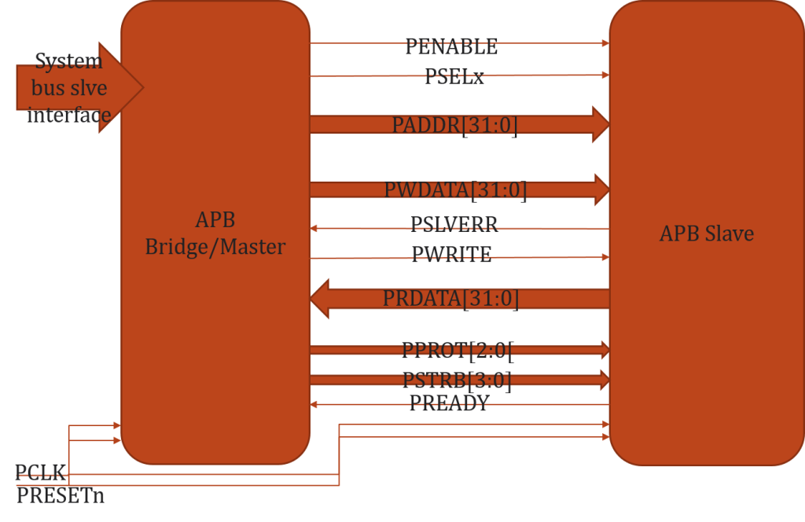
  <br>
    <a href="https://verificationforall.wordpress.com/apb-protocol/">AMBA APB Interface</a>
</p>

The AMBA APB (Advanced Peripheral Bus) interface is a part of the AMBA (Advanced Microcontroller Bus Architecture) family of protocols. The APB interface is primarily used to connect low-bandwidth peripherals to a system, and is optimized for low power consumption and reduced complexity.

In the APB interface, two key components are involved: the APB Master and the APB Slave.

1. **APB Master**: The master initiates and controls the transactions on the bus. The master generates the necessary control signals and addresses required for data transfer.
2. **APB Slave**: The slave is the peripheral device that responds to the requests from the master. It is addressed by the master and can send or receive data based on the control signals.

The interaction between the APB Master and APB Slave involves several signals:

- **PCLK**: This is the bus clock signal generated by the clock source. All operations are synchronized with this clock.
- **PRESETn**: This is an active-low asynchronous reset signal. When asserted (low), it resets all the modules connected to the bus.
- **PADDR[31:0]**: This is the address bus from the master to the slave, which can be up to 32 bits wide. The master uses this to specify the address of the slave it wants to communicate with.
- **PWDATA[31:0]**: This is the write data bus from the master to the slave. When the master wants to write data to a slave, it puts the data on this bus.
- **PRDATA[31:0]**: This is the read data bus from the slave to the master. When the master wants to read data from a slave, the data is put on this bus by the slave.
- **PSELx**: These are the slave select signals. There is one PSEL signal for each slave connected to the master.
- **PENABLE**: This signal from the master to the slave indicates the second and subsequent cycles of a transfer.
- **PWRITE**: This signal indicates whether the master wants to read data from or write data to the slave. When PWRITE is high, it means the master wants to write data. When it's low, it means the master wants to read data.
- **PREADY**: This is a signal from the slave to the master indicating that the slave is ready for a data transfer.
- **PSLVERR**: This signal from the slave to the master indicates whether the last data transfer was successful.
- **PPROT[2:0]**: These signals provide protection type for the transfer.
- **PSTRB[3:0]**: These signals indicate which byte lanes to update during the write transaction.

The actual operation involves a sequence of signal changes. Typically, the master will set the address and control signals, then the slave will respond by setting the PREADY and PSLVERR signals. All these operations are synchronized with the PCLK clock signal. The PRESETn signal can be used to reset the system at any time.


<br/><br/>
<!-- omit in toc -->
## <a name="amba-apb-signals"></a> AMBA APB Signal List [<sub><sup>Back to Table of Contents</sup></sub>](#toc)    
| Signal Name  | Source      | Destination       | Description                                                               |
|--------------|-------------|-------------------|---------------------------------------------------------------------------|
| PCLK         | Clock Source| All Modules       | APB bus clock                                                             |
| PRESETn      | Reset Source| All Modules       | Active low asynchronous reset                                             |
| PADDR[31:0]  | Master      | Slave             | Address bus from master to slave, up to 32 bits wide                      |
| PWDATA[31:0] | Master      | Slave             | Write data bus from master to slave, up to 32 bits wide                   |
| PRDATA[31:0] | Slave       | Master            | Read data bus from slave to master, up to 32 bits wide                    |
| PSELx        | Master      | Slave             | Slave select signal. One PSEL per slave (e.g., PSEL1, PSEL2,..., PSELn)  |
| PENABLE      | Master      | Slave             | Indicates second and subsequent cycles of a transfer                      |
| PWRITE       | Master      | Slave             | Read/Write indicator (LOW for read, HIGH for write)                       |
| PREADY       | Slave       | Master            | Indicates slave readiness. If LOW, the slave is not ready                 |
| PSLVERR      | Slave       | Master            | Transfer success/failure indicator. HIGH indicates failure, LOW indicates success |
| PPROT[2:0]   | Master      | Slave             | Protection signals indicating the type of access                          |
| PSTRB[3:0]   | Master      | Slave             | Byte-write strobes indicating which bytes of PWDATA to consider during write operation |


<br/>
<!-- omit in toc -->
## <a name="amba-apb-state"></a> AMBA APB State [<sub><sup>Back to Table of Contents</sup></sub>](#toc)    
<p align="center">
  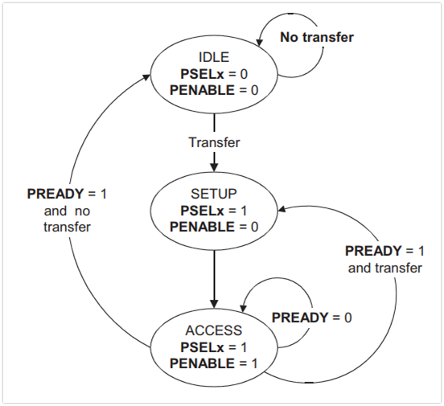
  <br>
    <a href="https://verificationforall.wordpress.com/apb-protocol/">AMBA APB State</a>
</p>
<br/>
The AMBA APB protocol operates in three specific states, each with its unique role in coordinating data transfer over the bus:

1. **Idle State**: The default state of the APB, where no communication or data transfers occur. The bus stays in the idle state until a transfer request is initiated.

2. **Setup State**: Triggered by a transfer request, the bus transitions from the Idle state to the Setup state. During this state, the APB master asserts the `PSELx` signal to select the intended slave for the data transfer. It also sets the address and control signals (read or write) onto the corresponding bus lines. The Setup state lasts for only one clock cycle, after which the bus moves to the Access state. Therefore, the slave module must sample the address and control information within this single Setup cycle.

3. **Access State**: Initiated by the assertion of the `PENABLE` signal by the master, the Access state is where the actual data transfer (read or write) takes place. For successful operation, key signals such as `PADDR` (address), `PWRITE` (write/read indicator), `PSELx` (slave select), and `PWDATA` (write data) must remain stable throughout this state.

These state transitions are synchronized with the clock signal, making the protocol a form of synchronous communication. Each state contributes significantly to facilitating smooth data transfer across the APB bus.

<!-- omit in toc -->
## <a name="amba-apb-read"></a> AMBA APB Simple Read Transaction [<sub><sup>Back to Table of Contents</sup></sub>](#toc)    
<p align="center">
  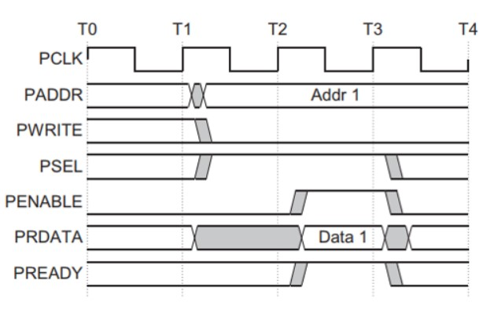
  <br>
    <a href="https://verificationforall.wordpress.com/apb-protocol/">AMBA APB Simple Read Transaction</a>
</p>
<br/>
At time marker T1, a READ transfer is initiated. This includes setting the `PADDR` signal with the address to be read, activating `PWRITE` to indicate a read operation, and asserting the appropriate `PSEL` line for the targeted slave. All these signals are latched at the subsequent rising edge of the system clock `PCLK`, signifying the commencement of the SETUP phase of the transfer.

In the interval following T1, during what we refer to as the SETUP phase, the master prepares to grant control to the slave. The address and control signals that were latched onto the bus during T1 are stable and available for the slave to sample.

Following T1, at the time marker T2, the `PENABLE` and `PREADY` signals are registered at the rising edge of `PCLK`. The `PENABLE` signal, when asserted, serves as an indicator that the ACCESS phase of the transfer has begun.

At the same time, the `PREADY` signal, when asserted, signifies that the slave is ready and can complete the transfer on the next rising edge of `PCLK` by furnishing the requested data on the `PRDATA` bus. It's important to note that the slave is required to supply the data prior to the end of the read transfer, specifically, before the time marker T3.

> **Note:** The slave device has the ability to effectively introduce wait states into the APB bus operation by controlling the `PREADY` signal. If the slave is not prepared to receive or transmit data, it can deassert `PREADY`. This action causes the master to wait until `PREADY` is reasserted before proceeding with the data transfer, hence creating a wait state.

<br/><br/>  
<!-- omit in toc -->
## <a name="amba-apb-write"></a> AMBA APB Simple Write Transaction [<sub><sup>Back to Table of Contents</sup></sub>](#toc)    
<p align="center">
  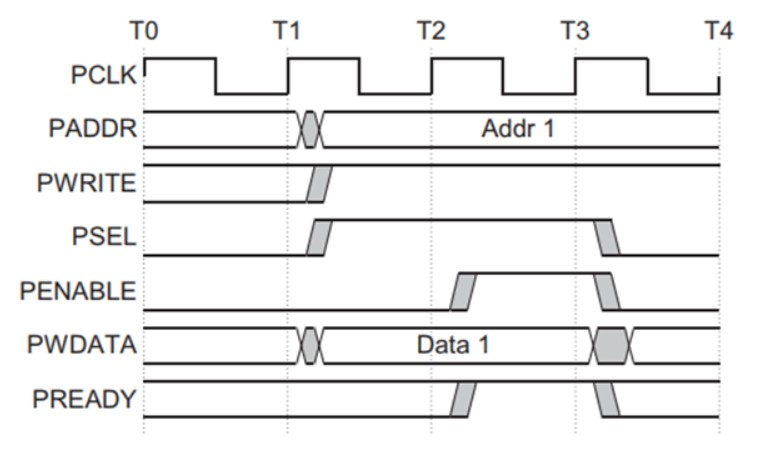
  <br>
    <a href="https://verificationforall.wordpress.com/apb-protocol/">AMBA APB Simple Write Transaction</a>
</p>
<br/>

At clock cycle T1, the initiation of a write transfer is signaled. This involves setting the PADDR, PWDATA, PWRITE, and PSEL signals. These signals are recorded at the next rising edge of the PCLK, marking the end of T1 and the beginning of T2. This phase is referred to as the Setup Phase of the transfer.

Moving into T2, two important signals are registered at the subsequent rising edge of the PCLK: PENABLE and PREADY. The assertion of PENABLE serves as a marker for the commencement of the ACCESS Phase. On the other hand, the assertion of PREADY signals that the slave device is prepared to finalize the transfer at the next PCLK's rising edge.

It's important to note that throughout the transfer, the PADDR, PDATA, and control signals should maintain their validity until the conclusion of the transfer at T3. The completion of the transfer at T3 is marked by the de-assertion of the PENABLE signal. 

Also at T3, if there is no subsequent transfer to the same slave, the PSEL signal is also de-asserted. 

> A notable characteristic of the APB protocol is that the slave device has the ability to inject wait states into the transfer process. It can do this by de-asserting the PREADY signal. This essentially "pauses" the transfer, allowing the slave more time to prepare for the completion of the operation. When the slave is ready, it can re-assert PREADY and the transfer can continue.

<br/><br/>

<!-- omit in toc -->
## <a name="amba-axi"></a> AMBA AXI Overview [<sub><sup>Back to Table of Contents</sup></sub>](#toc)
--- 
<p align="center">
  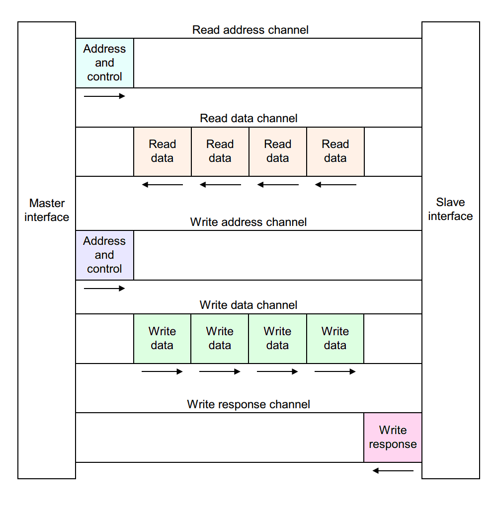
  <br>
    <a href="https://verificationforall.wordpress.com/apb-protocol/">AMBA AXI Architecture</a>
</p>
<br/>
The Advanced eXtensible Interface (AXI), part of the ARM Advanced Microcontroller Bus Architecture 3 (AMBA 3) and 4 (AMBA 4) specifications, is a parallel high-performance, synchronous, high-frequency, multi-master, multi-slave communication interface, mainly designed for high-speed on-chip communication. It provides high speed and high-performance points-to-points interconnect with multi-layer bus architecture.

One of the most distinguishing features of AXI is its ability to carry out read and write operations simultaneously. This concurrent operation is facilitated by its design, which uses separate channels for read and write operations. Consequently, read and write transactions can be processed independently and simultaneously, leading to improved overall throughput and system performance.

The need for AXI arose from the limitations of traditional bus protocols, such as AHB and APB. While they were suitable for earlier generations of microcontrollers and SOCs with simpler and fewer bus transactions, the increasing complexity of modern SOCs necessitated a more robust and flexible bus protocol, capable of handling a higher bandwidth. AXI, with its separate read and write channels and advanced features, was introduced to meet these demands.

AXI protocol defines five independent transaction channels: Read Address Channel, Read Data Channel, Write Address Channel, Write Data Channel, and Write Response Channel. These channels serve various purposes such as address and control information specification, data return, and transaction status indication. This separation of address/control and data phases, support for outstanding and out-of-order transactions, burst-based transactions, wider data bus configurations, and other features contribute to higher bus efficiency and increased performance.

In conclusion, the AXI interface, with its ability to perform simultaneous read and write operations, its support for multiple transaction channels, and advanced features, provides a highly efficient and robust solution for high-speed on-chip communication in modern SOCs.

<br/><br/>
<!-- omit in toc -->
## <a name="perf_metrics"></a> Performance Metrics and Timing Concepts in Circuits [<sub><sup>Back to Table of Contents</sup></sub>](#toc)
--- 
### Circuit Latency (L)
What is circuit latency? Latency is the time between the arrival of new input and generation of corresponding output.

For combinational circuits this is just TPD (Total Propagation Delay).

Example to calculate TPD
```
  A ----\
         \
          AND ----\
         /         \
  B ----/           OR --- D
                   /
  C --------------/     

```
Assumption:
- A, B, and C are available at time t = 0.
- The AND gate has a latency of 5 ns.
- The OR gate has a latency of 7 ns.  
<br/>

1. The signal at the output of the AND gate is ready at t = 0 (time when A and B are available) + 5 ns (AND gate latency) = 5 ns.
2. The signal at the output of the OR gate, which is the final output D, is ready at the maximum between t = 5 ns (when the output of the AND gate is ready) and t = 0 (time when C is available). Hence, D is ready at t = max(5 ns, 0 ns) + 7 ns (OR gate latency) = 12 ns.

Hence,  
TPD for D = 5ns + 7ns = 12ns
<br/><br/>

### Circuit Throughput (T)
The rate at which a circuit can process or produce operations, typically measured as the inverse of the circuit's propagation delay or latency. It is quantified as 1/TPD or 1/L, where TPD is the propagation delay and L is the latency.

- Propagation Delay (TPD): This is the time it takes for a signal to travel from the input to the output of a device. It is a key measure of the speed of a logic gate or circuit. It is concerned with the delay encountered by a single signal pulse.

- Latency (L): This refers to the total time it takes for a signal to travel from one point in a system to another. In a complex digital system, this would involve multiple stages and components, and hence latency is typically larger than the propagation delay of a single component. Latency can also refer to the delay before a transfer of data begins following an instruction for its transfer.

In summary, TPD refers to the delay of a single component or gate, while latency refers to the total delay from one end of a system to the other. In terms of calculating throughput, using TPD will refer to the maximum rate a single operation can be completed, while using L will give the rate at which a complete set of operations, or sequence of operations, can be completed.


Using the same example from section above. The throughput can be calcuated as follow:
```
Throughput = 1 / TPD  
           = 1 / 12 ns  
           = approximately 83.33 MHz (Mega "operations" per second)
```

<br/><br/>

## Pipelining to Increase Throughput
Pipelining is a critical strategy in computer architecture to significantly increase the throughput of a system. The basic idea behind pipelining is to divide the processing into stages and then process multiple instructions concurrently, with each instruction in a different stage.

Let's consider a simple 3-stage pipeline for a digital circuit that performs three operations on data:

Operation A: Multiply the input by 2
Operation B: Add 3 to the result
Operation C: Subtract 1 from the result
Without pipelining, the sequence of operations would look something like this for two sets of input data (D1 and D2):


| Time/Data | t1 | t2 | t3 | t4 | t5 | t6 |
|-----------|----|----|----|----|----|----|
| Data D1   | A  | B  | C  |    |    |    |
| Data D2   |    |    |    | A  | B  | C  |


Here, A, B, and C represent the operations performed on the data. The system performs Operation A on Data D1 at time t1, Operation B on Data D1 at time t2, and Operation C on Data D1 at time t3. Only after all these operations are complete does it start processing Data D2.

Now, let's introduce pipelining. The sequence of operations would now look like this:


| Time/Data | t1 | t2 | t3 | t4 |
|-----------|----|----|----|----|
| Data D1   | A  | B  | C  |    |
| Data D2   |    | A  | B  | C  |


In the pipelined version, as soon as Operation A is complete for Data D1 at time t2, Operation A for Data D2 starts. This overlapping of operations allows the system to process Data D2 while it's still processing Data D1, significantly increasing the throughput.

In essence, pipelining does not decrease the latency of an individual task, but it does increase the overall throughput of the system, making it a vital technique in computer architecture for enhancing system performance.

<br/><br/>  

### Important Time Concepts
#### Setup Time and Hold Time
- Setup Time: The interval before the clock edge during which data must be stable. The data input should not change in this period for correct operation.
- Hold Time: The interval after the clock edge during which data must remain stable. The data should not change in this period for correct operation.

- Setup Time Violation: This occurs when the data changes too close to the clock edge and does not respect the setup time. In other words, the data isn't stable long enough before the clock edge arrives. This may result in incorrect data being latched.

- Hold Time Violation: This occurs when the data changes too soon after the clock edge, not respecting the hold time. In other words, the data doesn't remain stable for long enough after the clock edge. This may result in incorrect data being latched.

<p align="center">
  
  <br>
    <a href="https://electronics.stackexchange.com/questions/347499/setup-and-hold-time-output-when-violated"> Setup Time and Hold Time</a>
</p>

<br/><br/>


#### Rise Time and Fall Time
- Rise Time: The rise time of a digital signal is the time required for the signal to change from a specified low value (usually 10% of the final value) to a specified high value (usually 90% of the final value). In other words, it's the time taken for a signal to change from a '0' (low) to a '1' (high).

- Fall Time: The fall time is exactly the opposite of the rise time. It is the time required for the signal to fall from a specified high value (usually 90% of the initial value) to a specified low value (usually 10% of the initial value). Essentially, it's the time taken for a signal to change from a '1' (high) to a '0' (low).

These timings are particularly important in high-speed digital circuits, as they can affect the proper functioning of the circuit. If a signal changes state too quickly, it may cause noise and other problems. Conversely, if it changes too slowly, it can cause timing problems. Therefore, designers often aim to control and optimize the rise and fall times to ensure reliable circuit operation.

<p align="center">
  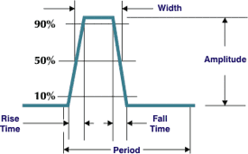
  <br>
    <a href="http://www.vlsijunction.com/2015/12/fall-time.html"> Rise Time and Fall Time</a>
</p>

<br/><br/>

#### Clock-to-Q delay (tCQ)

The Clock-to-Q delay (tCQ) is an important timing parameter in digital circuits, specifically with flip-flops and latches.

tCQ represents the time taken for the output of a flip-flop or latch to respond to a change in the clock signal.

In other words, when the clock edge (either rising or falling depending on the type of flip-flop) occurs, the input data will take some finite amount of time to propagate to the output. This delay is referred to as the Clock-to-Q delay (tCQ).

Designers must account for tCQ in the overall timing analysis to ensure that the next stage in a circuit will have valid data present at its input when its clock signal arrives. If tCQ is too long, it can lead to setup time violation and possibly incorrect behavior of the digital system.

<p align="center">
  
  <br>
    <a href="http://www.pldworld.info/_hdl/2/RESOURCES/www.ece.msstate.edu/_reese/EE3714/fftiming/sld005.htm"> Clock to Q Propagation Delay</a>
</p>


<br/><br/>  


<br/><br/>

